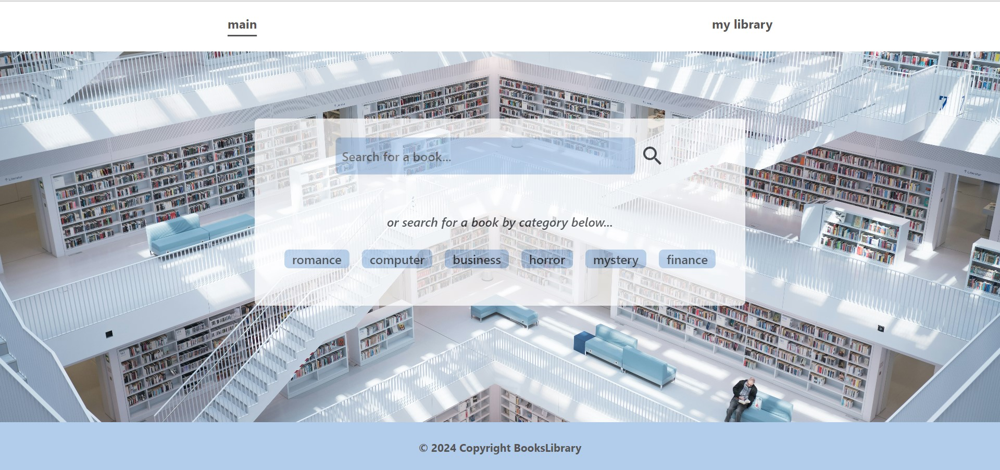
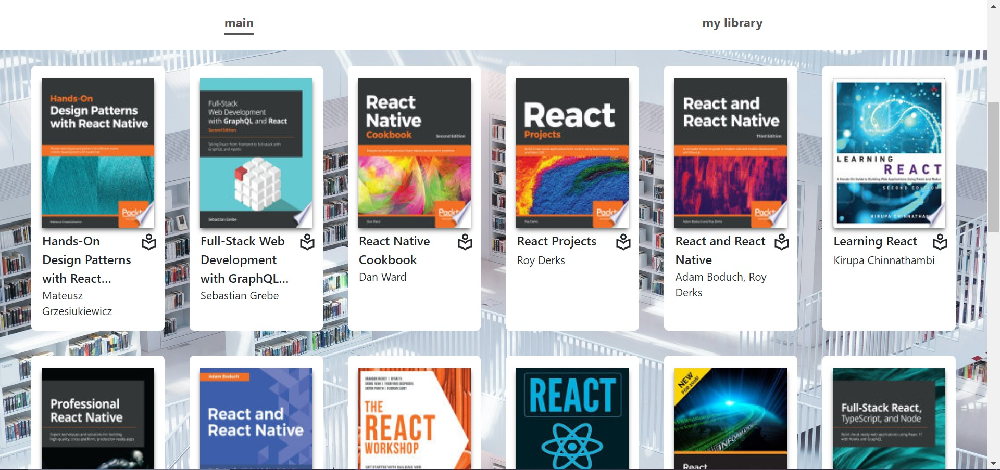
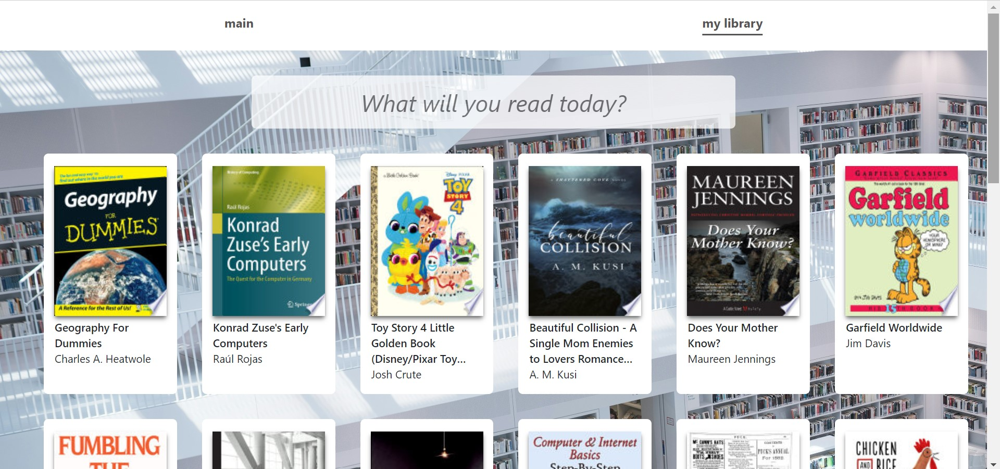
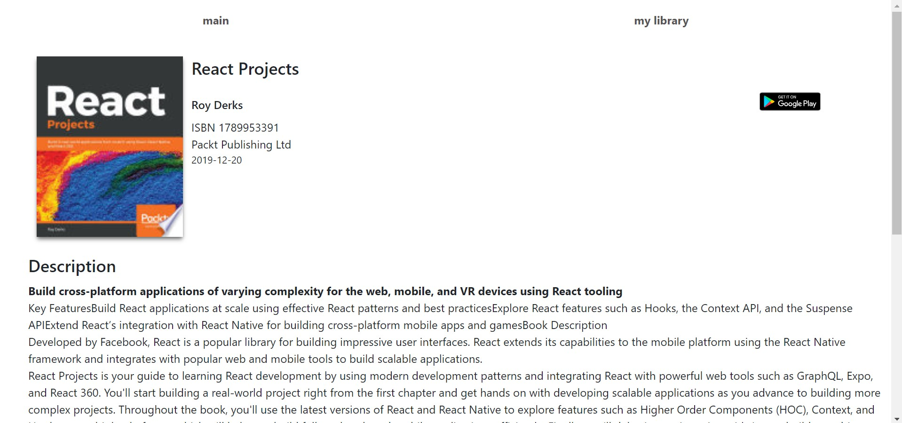
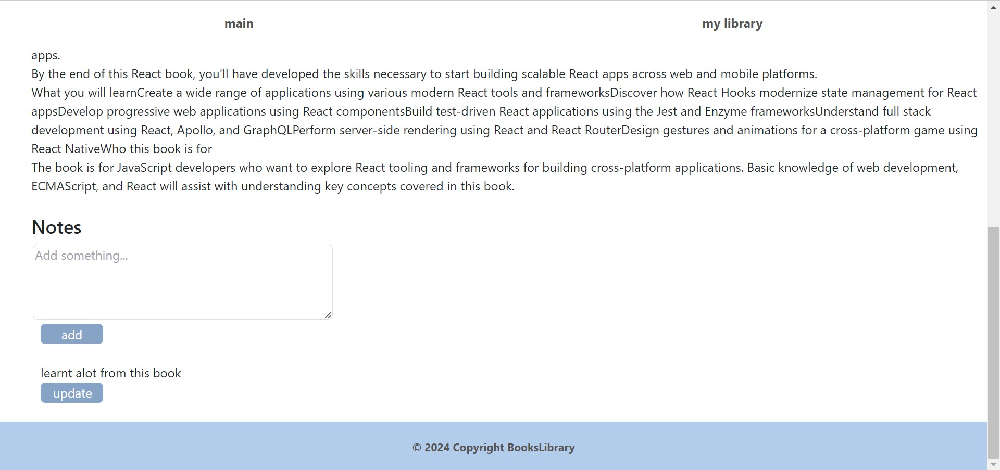
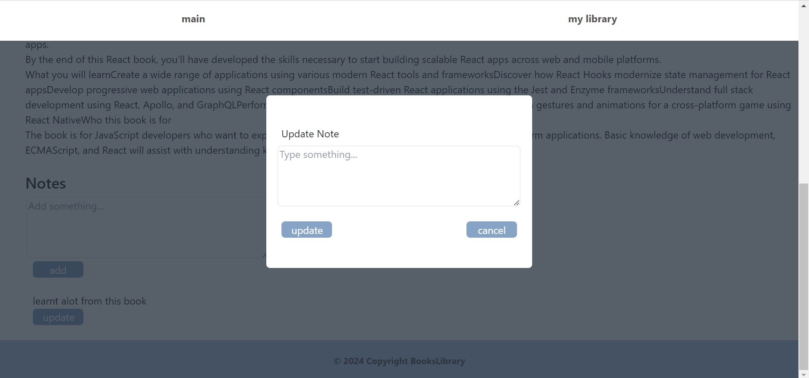

## Books Library

### Project Overview

This game was created as part of my project for General Assembly's Software Engineering Immersive Unit 2 - Front-End Development.

The following phases were done prior to project completion.

- Researching on available APIs
- Deciding on the API
- Creating user stories on a public board
- Doing up the wireframe and class hierachy [here ](https://drive.google.com/file/d/1fM9Zc3V_2jbzrDXYJLUl3-ymQriF0OWO/view?usp=drive_link)([amendments](https://drive.google.com/file/d/1Lo_fME0hh4Rmb2LzlvvNwJQjYrbar95b/view?usp=sharing) were made along the way while working on the code)
- Project proposal to instructors
- Working on the code
- Project presentation

### Description

This web application allows users to search for books by keyword, title, author or category. Users can add the books to "my library" to keep track of the books that they want to read. Upon clicking the book image in the "main" or "my library" pages, users can see more details of the book.

### Screenshots of Game

Main Page


List of Books on Main Page after searching


List of books on Library Page


Book Detail page


Add notes for each book in Book Detail Page


Update notes modal in Book Detail Page


### Technologies Used

#### React

- Used for state management
- Leveraged on react hooks such as useState, useEffect and useParams
- Created reusable UI components

#### Tailwind CSS

- Used for creating the user interface and styling the web application

#### Airtable

- Used as a database for CRUD operations

### Getting Started

The books library web application is available [here ](https://books-library-ga.netlify.app/).

A [public board](https://github.com/users/odebear27/projects/2) has been used for planning.

#### Installation

Clone the repository to your local machine

```
https://github.com/odebear27/books-library.git
```

Navigate to the project directory

```
cd books-library
```

Install the project dependencies

```
npm i
```

#### Running the application

Once the dependencies are installed, start the development server

```
npm run dev
```

### Next Steps

- Allow users to remove the book from "my library" page in order not to clutter up the space in "my library" page
- Create a list of "You may also like" books as a recommendation feature so that users can have more options
- Have an advanced book search function

### Development Environment

This web application was created on Windows 10 machine with a display resolution of 1920 x 1080, tested on Google Chrome browser Version 121.0.6167.187.

While efforts have been made to ensure compatibility across different screen sizes and browsers, there may be variations in styling and performance depending on your specific environment.

### Credits

I would like to acknowledge the below website for the use of image in my project.

- Background Image: Photo by Max Langelott on [Unsplash](https://unsplash.com/photos/high-raise-photography-of-library-wWQ760meyWI)
